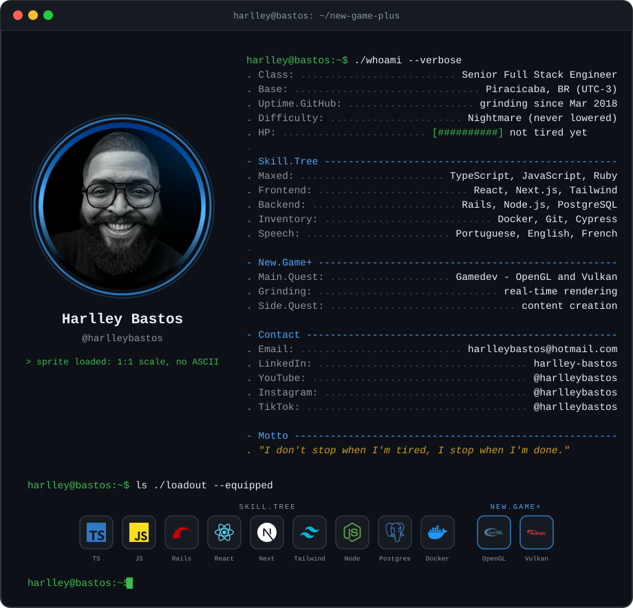

<!-- Terminal card generated by assets/gen_card.py — pixel-art sprite (the trademark), RPG character sheet, stack hotbar and the OpenGL/Vulkan hello triangle. -->

**Full stack pays the bills. The GPU is where the fun is.**

Senior Full Stack Engineer on a **New Game+** run into game development —
same discipline, new skill tree: OpenGL, Vulkan and real-time rendering.

 

#### `harlley@bastos:~$ git log --stat`

 

#### `harlley@bastos:~$ ./snake --hard-mode`

  <picture>
    <source media="(prefers-color-scheme: dark)" srcset="https://raw.githubusercontent.com/harlleybastos/harlleybastos/output/github-snake-dark.svg" />
    <source media="(prefers-color-scheme: light)" srcset="https://raw.githubusercontent.com/harlleybastos/harlleybastos/output/github-snake.svg" />
    
  </picture>

 

#### `harlley@bastos:~$ ./join --party`

 

**Open for collaborations that ship.**

 

#### `harlley@bastos:~$ exit`
